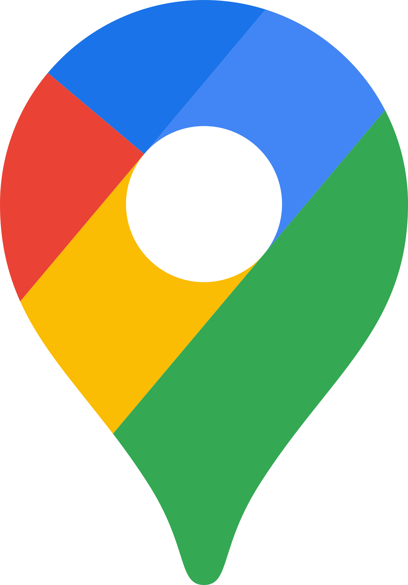

# RAGE GAPPS

  
  
  
  
  
  
  
  
  
  
  
  
  
  
  

 

    

 
This application is designed to serve as a launcher for Google applications. It allows users to quickly launch their preferred Google applications without typing in the search bar. The application uses Python on the server side with the Eel module, and it communicates with the client side to handle application launch requests.

## Technologies Used

- **Python**: The server-side logic is implemented in Python.
- **Eel**: A Python library for creating simple Electron-like desktop apps with HTML, CSS, and JavaScript.
- **HTML and JavaScript**: Used for the client-side interface and communication with the server.

## How It Works

1. **Client-Side Request:**
   - The user selects a Google application from the launcher interface.
   - The client-side sends a request to the server-side for the selected application.

2. **Server-Side Processing:**
   - The server-side, implemented in Python using the Eel module, receives the client's request.
   - The server identifies the selected application's and extract URL from the URL database.

3. **Opening in a New Browser Window as Application:**
   - The URL is passed as a parameter to the browser.
   - A completely new browser window is opened as application, displaying only the web content of the selected application.
   - Distractions, such as the search bar and other functionalities, are removed for a focused view.

## Getting Started

### Prerequisites

- [Python](https://www.python.org/) installed on your system.
- Install the required Python packages using `pip install -r requirements.txt`.

### Running the Application

1. Clone the repository: `git clone https://github.com/rajyavardhanbithale/gapps`
2. Navigate to the project directory: `cd gapps`
3. Run the application: `python main.py`

The application will launch, and you can start using it to quickly access your favorite Google applications.

## Contribution

Contributions are welcome! If you have suggestions, improvements, or bug fixes, feel free to open an issue or submit a pull request.

